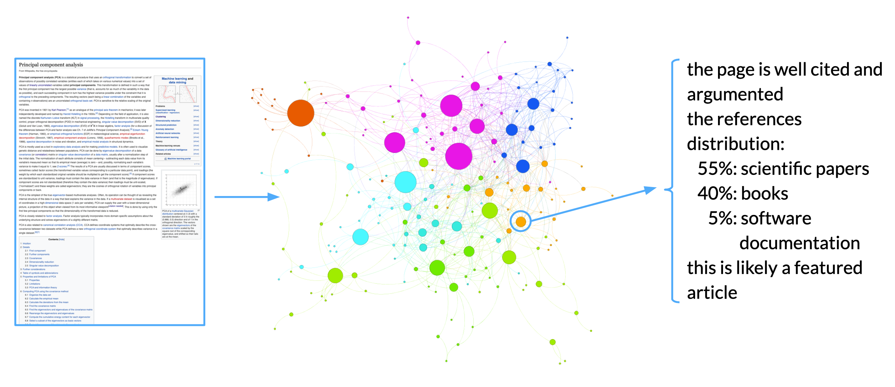
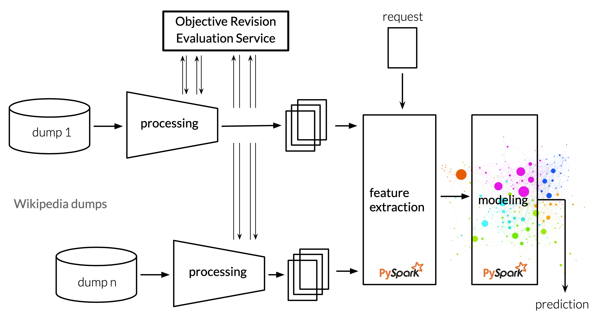

# Diversity of Wikipedia Article References
## Final project of Mining Massive Datasets course, July 2019

Authors:

* Sasha Chepurnoi
* Philipp Kofman
* Vadym Korshunov
* Yaroslava Lochman

## Project Description

The **diversity of resources and content** matters. When people are obtaining new knowledge, they don't want to be fooled with fake news or believe in information without proof from other authorized source. Sometimes Wikipedia articles may have poorly filled or unreferenced information, so, in the era of exponential data growth and post-truth, there is a huge need in automatic detection of articles with deficit of sources.

Our solution may help **readers** — to be more confident or sceptic about the information gained, as well as **editors** — such that they concentrate on the most important gaps of the article.

Moreover, noteworthy that there exist differences in the same article across different languages, that can be detected with our solution and fixed.

Our **problem statement** is to estimate the quality of the article, based on the references, in an unsupervised way. Unite and check the results of our modeling with results from ORES model.



See our full report in `Report.ipynb`.

## Project Pipeline

### Set up environment

```
virtualenv .env --python=python3
source .env/bin/activate
pip install -r requirements.txt
```

### Test our estimator
Run 
```
python ./test.py -t {your favourite english Wiki article} 2> /dev/null
```

For example
```
python test.py -t "Principal component analysis" 2> /dev/null
```
will output:
```
- the references distribution:
  >   76% scientific papers (journals, publications, etc)
  >   12% books
  >   12% internet resources (news, archive, etc)
  >    0% media materials (prints)
- this article has a good amount of content and references
- this is likely a featured article
```

### Train and test on sample data
Run `Pipeline.ipynb`.
The notebook represents all the pipeline stages with a small wiki dump. It allocates about 50MB of memory. All the data is written in `sample_data` directory. 

### Run full pipeline



#### Train
From root project folder run:

- `./load_wiki_data_full.sh` (loads full [2019-07-01 Wikipedia](https://dumps.wikimedia.org/enwiki/20190701/) data * )
- `python 1_data_collection/xml_to_csv.py --ores` (parses XML to CSV with streaming XML parser; fetches ORES assessments)
- `python 2_feature_engineering/csv_to_features.py --ores` (filters articles; transfroms to features)
- `python 3_modeling/features_to_clusters.py` (clusters the data using features; evaluates ans saves the model for testing)

\* If you want to download only subsample, edit the list of dumps in `data/dump_names.txt`.

#### Test
See [Test our estimator](#test-our-estimator)
